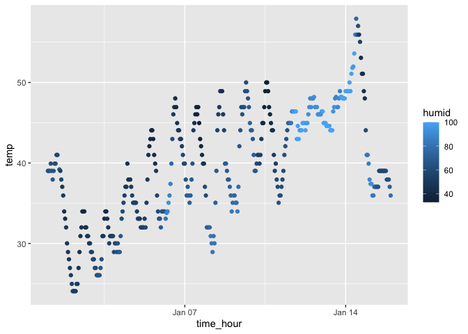

p8105_hw1_mkr2158
================
Matariya Rattanapan
2025-09-20

# Problem 1

Loading tidyverse and moderndive package

``` r
library(tidyverse)
```

    ## ── Attaching core tidyverse packages ──────────────────────── tidyverse 2.0.0 ──
    ## ✔ dplyr     1.1.4     ✔ readr     2.1.5
    ## ✔ forcats   1.0.0     ✔ stringr   1.5.1
    ## ✔ ggplot2   3.5.2     ✔ tibble    3.3.0
    ## ✔ lubridate 1.9.4     ✔ tidyr     1.3.1
    ## ✔ purrr     1.1.0     
    ## ── Conflicts ────────────────────────────────────────── tidyverse_conflicts() ──
    ## ✖ dplyr::filter() masks stats::filter()
    ## ✖ dplyr::lag()    masks stats::lag()
    ## ℹ Use the conflicted package (<http://conflicted.r-lib.org/>) to force all conflicts to become errors

``` r
library(moderndive)
```

Retreiving the dataset

``` r
data("early_january_weather")
```

The variables in this dataset include the origin, time of recording
(year, month, day, and hour), temperature, dewpoint, relative humidity,
wind direction, speed, gust, precipitation, pressure, visibility, and
data and hour of recording.

Some important variables to consider are: temp = temperature in
Fahrenheit time_hour = date and hour of the recording humid = relative
humidity

The dataset `early_january_weather` contains 358 hourly measurements and
15 variables.

The mean temperature from the dataset `early_january_weather` is
39.5821229.

``` r
ggplot(early_january_weather, aes(x=time_hour, y=temp, color=humid)) + geom_point()
```

<!-- -->

``` r
ggsave("early_january_weather_scatter.pdf", height = 4, width = 6)
```

This scatter plot shows that as the days in January went by, the
temperature would generally increase. In early January, the temperatures
were as low as around 25 degrees Fahrenheit, and towards the end it went
up to nearly 60 degrees Fahrenheit. Lower humidity was also seen in
earlier January days during low temperatures. Contrastingly, higher
humidity was seen towards the end of January alongside higher
temperatures.

# Problem 2

Making a data frame

``` r
hw1_df = 
  tibble(
    vec_numeric = rnorm(10),
    vec_char = c("Amy", "Bob", "Carl", "Dave", "Emily", "Frank", "Gina", "Hannah", "Isabelle", "Jack"),
    vec_logical = vec_numeric > 0,
    vec_factor = factor(c("Screened", "Refused", "Consented", "Screened", "Refused", "Consented", "Screened", "Refused", "Consented", "Screened"))
  )
```

Attempting to the take the mean of the variables created in the data
frame

``` r
mean(pull(hw1_df, vec_numeric))
```

    ## [1] 0.03231315

``` r
mean(pull(hw1_df, vec_char))
```

    ## Warning in mean.default(pull(hw1_df, vec_char)): argument is not numeric or
    ## logical: returning NA

    ## [1] NA

``` r
mean(pull(hw1_df, vec_logical))
```

    ## [1] 0.6

``` r
mean(pull(hw1_df, vec_factor))
```

    ## Warning in mean.default(pull(hw1_df, vec_factor)): argument is not numeric or
    ## logical: returning NA

    ## [1] NA

The mean was only taken for variables `vec_numeric` and `vec_logical`.

The mean for `vec_numeric` was 0.0323132 and the mean for `vec_logical`
is 0.6.

The mean was unable to be generated from variables `vec_char` and
`vec_factor` because the arguments are not numeric. Therefore, R cannot
run these calculation.

Running as.numeric to the logical, character, and factor variables

``` r
as.numeric(pull(hw1_df, vec_logical))
as.numeric(pull(hw1_df, vec_char))
as.numeric(pull(hw1_df, vec_factor))
```

Using the as.numeric function allows us to convert the variables into
numeric arguments. This function allows us to turn the logical and
factor variables into numeric arguments, which will allow us to
calculate the mean if we wanted to. However, vec_char still remains a
character variable and argument (due to it being Names and not numeric
data type), therefore we cannot calculate the mean of this variable
still.
